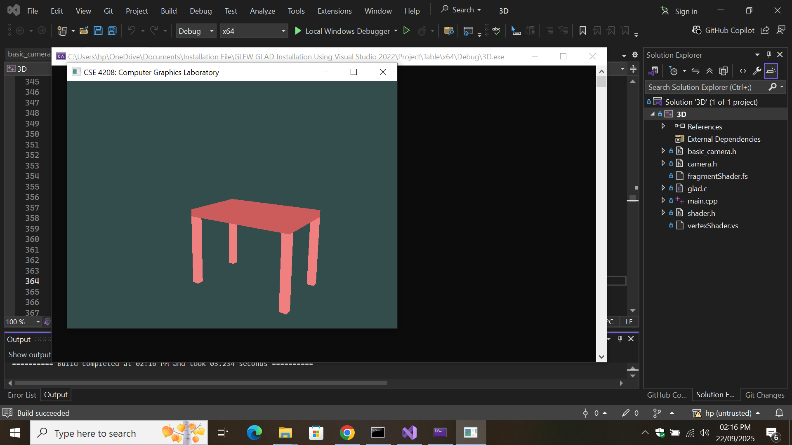

# 🎨 OpenGL 3D Project – Tasble

This is my **OpenGL 3D Graphics Project** developed in **C++** using **Visual Studio 2022**, **GLFW**, **GLAD**, and **OpenGL (3.3 Core Profile)**.  
The project renders a 3D **Table** with different transformations, shaders, and camera controls.

---

## ✨ Features
- 3D modeling of **Table**
- Object transformations: **Translate, Rotate, Scale**
- Camera movement & zoom
- Custom colors with vertex and fragment shaders
- Interactive keyboard & mouse controls

---

## ⚙️ Requirements
To build and run this project, you need:
- [Visual Studio 2022](https://visualstudio.microsoft.com/)
- [GLFW](https://www.glfw.org/download.html)
- [GLAD](https://glad.dav1d.de/)
- OpenGL 3.3 or later
- (Optional) [CMake](https://cmake.org/download/)

---

## 🚀 Setup Instructions

1. Clone this repository:
   ```bash
   git clone https://github.com/sr7ratul/OpenGL-3D-Table.git
cd OpenGL-3D-Table

````

2. Open the `3D.sln` file with **Visual Studio 2022**.

3. Configure library linking:

   * Add `glfw3.lib`
   * Add `opengl32.lib`

4. Build the solution in **Debug** or **Release** mode.

5. Run the project → You will see the 3D **Table** rendered.

---

## 🎮 Controls

| Key                       | Action                |
| ------------------------- | --------------------- |
| **W / A / S / D**         | Move Camera           |
| **Mouse Move**            | Look Around           |
| **Scroll Wheel**          | Zoom In / Out         |
| **X / Y / Z**             | Rotate around axis    |
| **I / J / K / L / O / P** | Translate object      |
| **C / V / B / N / M / U** | Scale object          |
| **H / F / T / G / Q / E** | Move Eye position     |
| **1 – 6**                 | Change LookAt point   |
| **7 / 8 / 9**             | Change View Up Vector |
| **ESC**                   | Exit the program      |

---

## 📂 Project Structure

```
OpenGL-3D-Project-table/
│── 3D.sln
│── 3D.vcxproj
│── main.cpp
│── shader.h
│── camera.h
│── basic_camera.h
│── vertexShader.vs
│── fragmentShader.fs
│── README.md
│── .gitignore
```

---

## 📸 Screenshot

Here is a preview of the project:




---

## 👤 Author
Developed by **M M SAKIB AL HASAN**  
🔗 [GitHub Profile](https://github.com/sr7ratul)  


---

## 📜 License
This project is licensed under the MIT License – see the [LICENSE](LICENSE) file for details.
